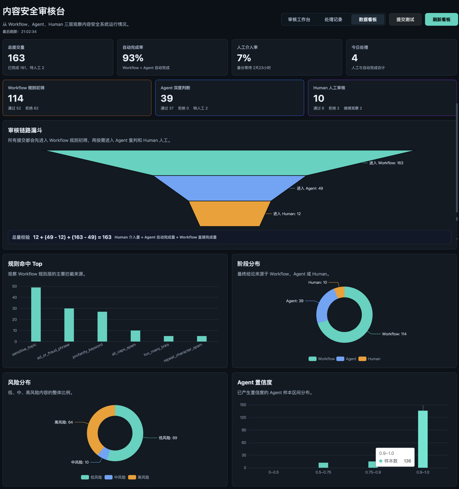
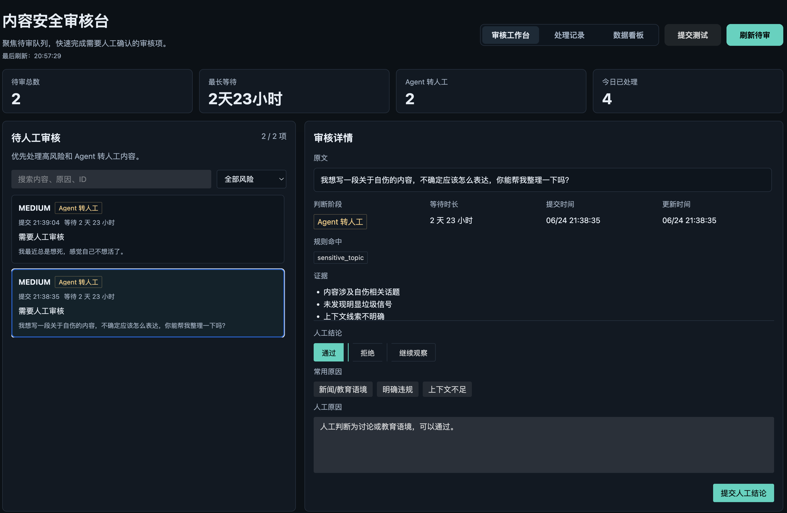
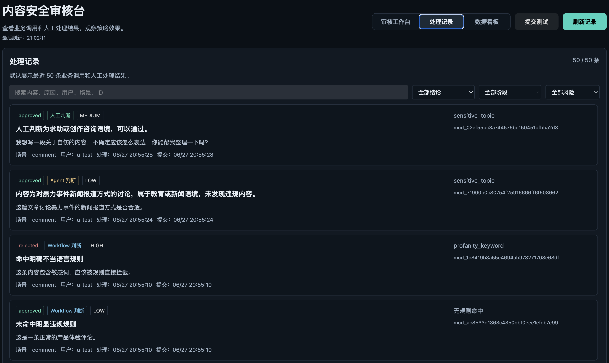
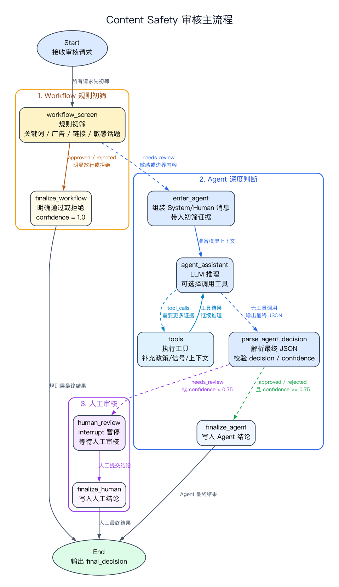

<div align="center">

# Content Safety

### 可中断、可恢复、可审计的内容安全审核工作流

**A human-in-the-loop content moderation starter built with LangGraph, FastAPI and Vue.**

[](https://www.python.org/)
[](https://fastapi.tiangolo.com/)
[](https://github.com/langchain-ai/langgraph)
[](https://vuejs.org/)
[](LICENSE)

规则快速筛选，Agent 结合上下文复判，疑难内容转入人工审核；<br>
通过 LangGraph checkpoint 在人工结论提交后从中断点恢复，并保留完整审计记录。

[快速开始](#快速开始) · [产品能力](#产品能力) · [工作原理](#工作原理) · [API 示例](#api-示例) · [项目结构](#项目结构)

</div>



## 为什么做这个项目

真实业务中的内容审核很少是简单的“命中关键词就拒绝”：

- 明确违规内容需要低成本、低延迟地直接拦截；
- 新闻、教育、引用和讨论语境不能只靠关键词判断；
- 模型无法确定的高风险内容需要可靠地交给人工；
- 每次判断都需要能够解释、追踪和复盘。

Content Safety 将这几类需求放进同一条审核链路：

```text
业务系统
   │
   ▼
Workflow 规则初筛 ── 明确结果 ──────────────► approved / rejected
   │
   └── 需要上下文判断
              │
              ▼
         Agent 深度复判 ── 明确结果 ─────────► approved / rejected
              │
              └── 置信度不足或风险较高
                         │
                         ▼
                 LangGraph interrupt
                         │
                         ▼
                    Human 人工审核
                         │
                         ▼
                 从 checkpoint 恢复执行
```

## 产品能力

| 能力 | 说明 |
| --- | --- |
| Workflow 规则初筛 | 根据可配置规则快速识别敏感词、广告导流、重复字符、链接滥用等内容 |
| Agent 深度判断 | 使用本地 Ollama 模型分析上下文、风险等级、判断证据与置信度 |
| Human-in-the-loop | 对不确定内容触发 LangGraph interrupt，等待人工通过、拒绝或继续观察 |
| 中断恢复 | 使用 SQLite checkpoint 保存图状态，人工提交结论后从原线程恢复 |
| 审核工作台 | 集中处理待审内容，展示原文、规则命中、证据、风险和等待时长 |
| 全链路审计 | 查询 Workflow、Agent、Human 各阶段的判断结果和处理记录 |
| 数据看板 | 展示自动完成率、人工介入率、审核漏斗、规则命中和风险分布 |
| API 接入 | 提供 FastAPI 接口、自动生成的 OpenAPI 文档和模拟业务调用脚本 |

> [!NOTE]
> 当前版本定位为可运行、可扩展的 MVP 与工程参考实现，不代表生产级内容安全服务。

## 产品界面

### 人工审核工作台

待审队列与审核详情采用左右联动布局。审核人员可以查看判断阶段、命中规则、模型证据与等待时长，再提交人工结论。



### 全链路处理记录

统一查看来自 Workflow、Agent 和 Human 的结论，支持按内容、原因、用户、场景、阶段和风险等级检索。



### 审核运营数据

从请求总量、自动完成率和人工介入率出发，进一步观察审核链路漏斗、主要命中规则、风险分布与 Agent 置信度。


## 工作原理

### 1. Workflow：确定性规则优先

所有内容首先进入低成本规则层。明确安全或明确违规的内容直接完成审核，避免不必要的模型调用。

规则位于 [`backend/config/rules.yaml`](backend/config/rules.yaml)，可以按业务场景继续扩展。

### 2. Agent：处理上下文与模糊语义

规则无法给出可靠结论时，Agent 会结合原文、规则信号与上下文输出：

- 审核结论；
- 风险等级；
- 判断原因与证据；
- 置信度；
- 是否需要转人工。

默认通过 Ollama 使用 `qwen3-coder:30b`，可通过环境变量替换模型。

### 3. Human：在关键位置保留人工控制

当 Agent 置信度不足、上下文不明确或内容风险较高时，LangGraph 暂停当前线程。人工审核台提交结论后，系统使用 `thread_id` 找回 checkpoint 并恢复执行，而不是重新开始一次审核。

### 4. Audit：让每次判断可以复盘

系统将审核结果写入 SQLite，同时保留 JSONL 审计日志。数据看板基于各阶段记录聚合，帮助观察策略效果和人工工作量。

## 技术栈

| 层级 | 技术 |
| --- | --- |
| 工作流编排 | LangGraph |
| API 服务 | FastAPI、Pydantic |
| Agent | LangChain、Ollama |
| 持久化 | SQLite、LangGraph Checkpoint、JSONL |
| 审核台 | Vue 3、TypeScript、Naive UI、ECharts |
| Python 工程 | uv、pytest、Ruff |
| 前端工程 | pnpm、Vite、vue-tsc |

## 快速开始

### 环境要求

- Python 3.13+
- [uv](https://docs.astral.sh/uv/)
- Node.js 20+
- [pnpm](https://pnpm.io/)
- [Ollama](https://ollama.com/)（仅 Agent 深度判断需要）

### 1. 克隆项目

```bash
git clone https://github.com/yauld/content-safety.git
cd content-safety
```

### 2. 启动后端

```bash
cd backend
cp .env.example .env
uv sync --dev
uv run content-safety-api
```

后端默认运行在 `http://localhost:8002`：

- API 文档：`http://localhost:8002/docs`
- 健康检查：`http://localhost:8002/health`

如果需要体验 Agent 判断，先准备本地模型：

```bash
ollama pull qwen3-coder:30b
ollama serve
```

机器资源有限时，可以在 `backend/.env` 中将 `CONTENT_SAFETY_MODEL` 修改为已安装的其他 Ollama 模型。

### 3. 启动审核台

新开一个终端：

```bash
cd frontend
pnpm install
VITE_API_TARGET=http://localhost:8002 pnpm dev
```

访问 `http://localhost:5173`。

### 4. 生成演示数据

后端启动后，在项目根目录运行：

```bash
python3 examples/mock_business_client.py --all
```

也可以分别验证不同规则：

```bash
python3 examples/mock_business_client.py --profanity
python3 examples/mock_business_client.py --sensitive-topics
python3 examples/mock_business_client.py --ad-phrases
```

## API 示例

### 提交内容审核

```bash
curl -X POST http://localhost:8002/moderate \
  -H "Content-Type: application/json" \
  -d '{
    "request_id": "demo-001",
    "scene": "comment",
    "user_id": "user-001",
    "content": "这是一条正常的产品体验评论。"
  }'
```

典型响应：

```json
{
  "request_id": "demo-001",
  "moderation_id": "mod_xxx",
  "thread_id": "thread_xxx",
  "status": "completed",
  "decision": "approved",
  "reason": "未命中明显违规规则",
  "risk_level": "low",
  "decision_stage": "workflow",
  "evidence": [],
  "rule_hits": [],
  "confidence": 1.0,
  "interrupt": null
}
```

### 查询待人工审核内容

```bash
curl http://localhost:8002/reviews/pending
```

### 提交人工结论并恢复工作流

```bash
curl -X POST http://localhost:8002/moderate/thread_xxx/resume \
  -H "Content-Type: application/json" \
  -d '{
    "decision": "approved",
    "reason": "属于新闻或教育讨论语境，可以通过。"
  }'
```

完整接口定义可在服务启动后查看 Swagger UI：`http://localhost:8002/docs`。

## 项目结构

```text
content-safety/
├── backend/
│   ├── config/                 # Workflow 审核规则
│   ├── docs/                   # LangGraph 结构图
│   ├── scripts/                # 图导出等辅助脚本
│   ├── src/content_safety/
│   │   ├── workflow.py         # 确定性规则初筛
│   │   ├── agent.py            # Agent 深度判断
│   │   ├── graph.py            # LangGraph 编排与中断恢复
│   │   ├── review.py           # 人工审核节点
│   │   ├── store.py            # 审计与统计存储
│   │   ├── service.py          # 业务服务层
│   │   └── main.py             # FastAPI 入口
│   └── tests/
├── frontend/                   # Vue 内容安全审核台
├── data/                       # 本地 SQLite、checkpoint、审计和评测数据
├── docs/
│   ├── images/                 # 产品截图
│   └── mvp-implementation-guide.md
└── examples/
    └── mock_business_client.py # 模拟业务系统
```

## 测试与构建

后端：

```bash
cd backend
uv run pytest
uv run ruff check .
```

前端：

```bash
cd frontend
pnpm install
pnpm build
```

## 导出 LangGraph 结构图

第一次导出前安装 Graphviz 和 pygraphviz：

```bash
brew install graphviz
cd backend
uv add --dev pygraphviz
```

在 `backend/` 目录运行：

```bash
uv run python scripts/export_graph.py
```

默认输出到 [`backend/docs/content-safety-graph.png`](backend/docs/content-safety-graph.png)。



## 当前边界

- 默认规则和评测样本用于演示，不构成完整行业审核标准；
- Agent 输出可能出现误判，不能替代高风险场景中的专业审核；
- 当前使用 SQLite，适合本地开发和 MVP 验证；
- 当前未实现账号权限、审核任务分配、限流与生产级监控；
- 接入真实业务前，应补充领域数据评测、隐私保护与安全合规审查。

## Roadmap

- [ ] 将规则升级为可插拔策略包
- [ ] 扩展多模型与多供应商适配
- [ ] 增加离线评测、准确率与误判率报告
- [ ] 增加审核员权限和任务分配
- [ ] 支持 PostgreSQL 与生产部署
- [ ] 增加策略版本管理与回放能力

## License

本项目基于 [MIT License](LICENSE) 开源。

---

如果这个项目对你有帮助，欢迎 Star、提交 Issue，或分享你在实际内容审核场景中的需求。
